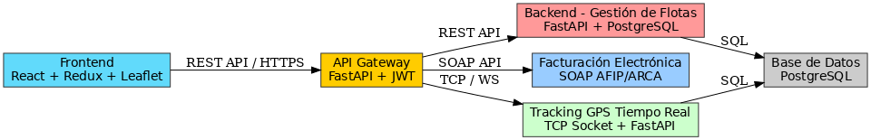

# 🚛 Sistema Logístico - Plataforma Integral de Gestión de Flotas


El **Sistema Logístico** es un ecosistema de microservicios diseñado para la gestión integral de transporte, cubriendo desde la administración de recursos hasta el rastreo en tiempo real y la facturación fiscal automatizada.

Diseñado bajo una arquitectura **desacoplada**, garantiza escalabilidad, seguridad a través de un Gateway centralizado y despliegue contenerizado.

---

## 🏗️ Arquitectura del Ecosistema

El sistema se compone de módulos independientes que se comunican a través de APIs REST y protocolos TCP:



### 🧩 Módulos del Sistema
| Módulo | Descripción | Tecnologías | Repositorio |
| :--- | :--- | :--- | :--- |
| **Frontend** | Interfaz de usuario SPA | React, Redux, Leaflet | [Ver Repo](https://github.com/Brian13b/SistemaLogistico-frontend) |
| **API Gateway** | Puerta de enlace y seguridad | FastAPI, JWT | [Ver Repo](https://github.com/Brian13b/SistemaLogistico-gateway) |
| **Backend Core** | Gestión de flota y usuarios | FastAPI, PostgreSQL | [Ver Repo](https://github.com/Brian13b/SistemaLogistico-backend) |
| **Facturación** | Conexión fiscal AFIP/ARCA | FastAPI, SOAP (Zeep) | [Ver Repo](https://github.com/Brian13b/SistemaLogistico-facturacion) |
| **Tracking** | Servidor TCP y API GPS | Python Sockets, FastAPI | [Ver Repo](https://github.com/Brian13b/SistemaLogistico-tracking) |
| **DevOps** | Orquestación Docker | Docker Compose | [Ver Repo](https://github.com/Brian13b/SistemaLogistico-devops) |

---

## 🖥️ Capturas de Pantalla

| Dashboard | Seguimiento en Vivo |
| :---: | :---: |
|  |  |

| Gestión de Vehículos | Reportes |
| :---: | :---: |
|  |  |

---

## 🚀 Cómo Empezar (Despliegue Local)

Para levantar todo el ecosistema, recomendamos usar el repositorio de infraestructura:

1.  Clonar el repositorio DevOps:
    ```bash
    git clone [https://github.com/Brian13b/SistemaLogistico-devops.git](https://github.com/Brian13b/SistemaLogistico-devops.git)
    ```
2.  Configurar las variables de entorno (`.env`) según la documentación.
3.  Ejecutar con Docker Compose:
    ```bash
    docker compose up -d --build
    ```

---

## 🌱 Futuras Actualizaciones
- [ ] **App Móvil:** Desarrollo de aplicación nativa (React Native) para conductores.
- [ ] **IA Predictiva:** Mantenimiento predictivo de vehículos basado en kilometraje.
- [ ] **Notificaciones Push:** Sistema de alertas en tiempo real (WebSockets).
- [ ] **CI/CD:** Pipelines automatizados con GitHub Actions.

---

## 👤 Autor

**Brian Battauz** *Backend & Frontend Developer* [GitHub Profile](https://github.com/Brian13b)