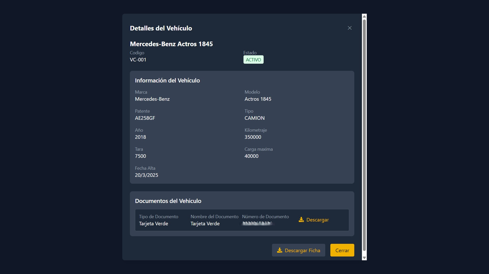

# 🚛 Sistema Logístico - Plataforma Integral

El **Sistema Logístico** es un conjunto de microservicios diseñados para la gestión completa de flotas, viajes, facturación y rastreo en tiempo real.  
Está diseñado bajo una arquitectura de **microservicios**, integrados a través de un **API Gateway**, garantizando **escalabilidad, seguridad y flexibilidad**.

---

## 🏗️ Arquitectura General

### Módulos principales
- **Frontend** → [SistemaLogistico-frontend](https://github.com/Brian13b/SistemaLogistico-frontend)  
- **Backend (Gestión de flotas)** → [SistemaLogistico-backend](https://github.com/Brian13b/SistemaLogistico-backend)  
- **API Gateway** → [SistemaLogistico-gateway](https://github.com/Brian13b/SistemaLogistico-gateway)  
- **Facturación electrónica** → [SistemaLogistico-facturacion](https://github.com/Brian13b/SistemaLogistico-facturacion)  
- **Tracking GPS en tiempo real** → [SistemaLogistico-tracking](https://github.com/Brian13b/SistemaLogistico-tracking)  

---

## 🔧 Tecnologías principales
- **Backend** → FastAPI (Python), PostgreSQL, JWT  
- **Frontend** → React, Redux, Leaflet, TailwindCSS 
- **Facturación** → SOAP (AFIP / ARCA Argentina)  
- **Tracking** → TCP Socket Server + FastAPI  
- **Gateway** → FastAPI + JWT   

---

## 🚀 Cómo empezar
1. Clonar los repositorios individuales (o usar el repo `SistemaLogistico-devops`).  
2. Configurar los archivos `.env` en cada módulo.  
3. Levantar los servicios con Docker Compose desde el repo de infraestructura.  

---

## 🖥️ Capturas de la Plataforma

### Inicio Sesion 

### Dashboard

### Gestión de Vehículos

### Gestión de Conductores

### Gestión de Viajes

### Modales de Gestión

### Reportes y Análisis

### Seguimiento en Tiempo Real

---

## 👥 Contribución
¡Toda ayuda es bienvenida!
