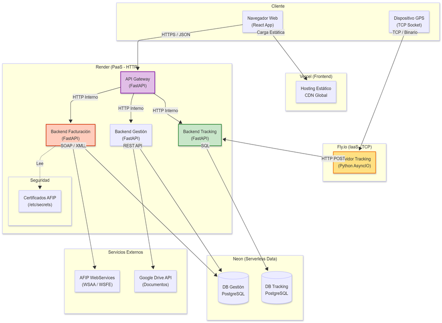

# 🚛 Sistema Logístico - Plataforma Integral de Gestión de Flotas


El **Sistema Logístico** es un ecosistema de microservicios diseñado para la gestión integral de transporte, cubriendo desde la administración de recursos hasta el rastreo en tiempo real y la facturación fiscal automatizada.

Diseñado bajo una arquitectura **desacoplada**, garantiza escalabilidad, seguridad a través de un Gateway centralizado y despliegue contenerizado.

---

## 🏗️ Arquitectura del Ecosistema

El sistema se compone de módulos independientes que se comunican a través de APIs REST y protocolos TCP:



### 🧩 Módulos del Sistema
| Módulo | Descripción | Tecnologías | Repositorio |
| :--- | :--- | :--- | :--- |
| **Frontend** | Interfaz de usuario SPA | React, Redux, Leaflet | [Ver Repo](https://github.com/Brian13b/SistemaLogistico-frontend) |
| **API Gateway** | Puerta de enlace y seguridad | FastAPI, JWT | [Ver Repo](https://github.com/Brian13b/SistemaLogistico-gateway) |
| **Backend Core** | Gestión de flota y usuarios | FastAPI, PostgreSQL | [Ver Repo](https://github.com/Brian13b/SistemaLogistico-backend) |
| **Facturación** | Conexión fiscal AFIP/ARCA | FastAPI, SOAP (Zeep) | [Ver Repo](https://github.com/Brian13b/SistemaLogistico-facturacion) |
| **Tracking** | Servidor TCP y API GPS | Python Sockets, FastAPI | [Ver Repo](https://github.com/Brian13b/SistemaLogistico-tracking) |
| **DevOps** | Orquestación Docker | Docker Compose | [Ver Repo](https://github.com/Brian13b/SistemaLogistico-devops) |

---

## 🖥️ Capturas de Pantalla

| Dashboard | Seguimiento en Vivo |
| :---: | :---: |
|  |  |

| Gestión de Vehículos | Reportes |
| :---: | :---: |
|  |  |

---

## 🚀 Cómo Empezar (Despliegue Local)

Para levantar todo el ecosistema, recomendamos usar el repositorio de infraestructura:

1.  Clonar el repositorio DevOps:
    ```bash
    git clone [https://github.com/Brian13b/SistemaLogistico-devops.git](https://github.com/Brian13b/SistemaLogistico-devops.git)
    ```
2.  Configurar las variables de entorno (`.env`) según la documentación.
3.  Ejecutar con Docker Compose:
    ```bash
    docker compose up -d --build
    ```

---

## 🚀 Roadmap & Próximos Pasos

El proyecto se encuentra en evolución continua, con el objetivo de escalar la arquitectura actual de "Proyecto Final" hacia un producto **SaaS (Software as a Service)** robusto y comercializable.

A continuación se detallan las mejoras planificadas:

### 🏗️ Arquitectura y Escalabilidad

- [ ] **Optimización de Carga de Datos (Server-Side Pagination)**
  - *Situación actual:* Carga de datasets completos que impacta en el rendimiento del frontend.
  - *Implementación:* Modificar endpoints de FastAPI para aceptar parámetros `skip` y `limit`. Implementar paginación en base de datos (SQLAlchemy) y virtualización de tablas en React (TanStack Table) para manejar miles de registros fluidamente.

- [ ] **Arquitectura Multi-tenencia (SaaS)**
  - *Objetivo:* Permitir que múltiples empresas gestionen sus flotas de forma aislada en la misma instancia.
  - *Implementación:* Estrategia de **"Shared Database, Shared Schema"**.
    1. Agregar columna `tenant_id` a todas las tablas críticas.
    2. Middleware en FastAPI para interceptar requests y aplicar **Row Level Security** a nivel de aplicación (filtrado automático por empresa).
    3. Gestión dinámica de credenciales de ARCA (Certificados por Tenant) para facturación independiente.

- [ ] **Cacheo con Redis**
  - *Objetivo:* Reducir latencia en lecturas frecuentes.
  - *Implementación:* Integrar Redis para cachear recursos estáticos o de baja mutabilidad (Marcas, Tipos de carga, Localidades), reduciendo la carga sobre PostgreSQL.

### 🤖 Inteligencia & Automatización

- [ ] **IA Predictiva para Mantenimiento**
  - *Objetivo:* Anticipar necesidades mecánicas antes de que ocurran fallas.
  - *Implementación:* Algoritmos de regresión lineal que analizan el historial de consumo de combustible y kilometraje diario para predecir la fecha exacta del próximo servicio técnico, evolucionando hacia modelos de Machine Learning para detección de anomalías.

- [ ] **Dashboard de Rentabilidad**
  - *Objetivo:* Business Intelligence.
  - *Implementación:* Endpoints de agregación que crucen datos de `Ingresos (Facturación)` vs `Costos (Combustible estimado + Mantenimiento + Salarios)`, generando gráficos de rentabilidad por unidad.

### 💻 Experiencia de Usuario (UX) y Real-Time

- [ ] **Notificaciones Push y WebSockets**
  - *Objetivo:* Inmediatez en la toma de decisiones.
  - *Implementación:* Migración del sistema de alertas (Exceso de velocidad, Vencimientos) a una arquitectura orientada a eventos con **WebSockets**. Integración con la API de Notificaciones del Navegador para avisos "Push" al operador.

- [ ] **App Móvil para Choferes (PWA)**
  - *Objetivo:* Digitalizar la confirmación de entregas.
  - *Implementación:* Desarrollo de una Progressive Web App (PWA) ligera para visualización de hoja de ruta y carga de remitos firmados desde el celular.

### 🛠️ DevOps & Calidad de Código

- [ ] **CI/CD Pipelines (GitHub Actions)**
  - *Objetivo:* Automatizar el ciclo de vida del desarrollo.
  - *Implementación:* Configuración de workflows para ejecución automática de tests unitarios (PyTest), análisis estático de código (Linting) y despliegue automático a Render tras la aprobación de PRs.

- [ ] **Logs de Auditoría**
  - *Objetivo:* Seguridad y trazabilidad.
  - *Implementación:* Middleware que registre cada operación de escritura (`POST`, `PUT`, `DELETE`) en una tabla inmutable `audit_logs`, guardando: *Quién, Cuándo y Qué cambió*.

---

## 👤 Autor

**Brian Battauz** *Backend & Frontend Developer* [GitHub Profile](https://github.com/Brian13b)
